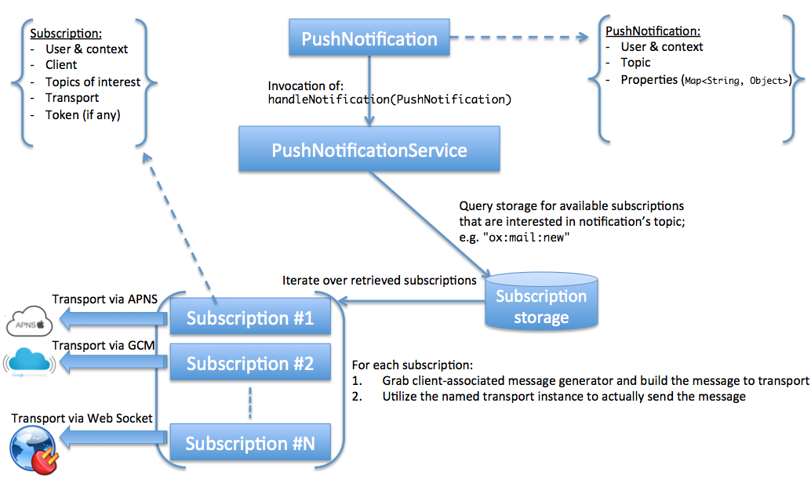

# Introduction

Starting with v7.8.3 the Open-Xchange Middleware implemented a generic Push Notification Service that supports delivering arbitrary
user-associated push notification messages to multiple clients in a transport-agnostic way.

# Big picture



# How it works

Several event-trapping locations inside the Open-Xchange Middleware are allowed to pass messages consisting of a topic name and arbitrary
associated properties to the OSGi singleton service `com.openexchange.pns.PushNotificationService`. For instance, the listeners for new
incoming mails pass a message with topic `"ox:mail:new"` along-side with (at least) associated mail folder.

Then that service looks-up every existing explicit or implicit subscriptions for every client that signals interest for notification's topic.
A subscription provides for a certain user/client pair:

 - The topics of interest; one/multiple identifiers or using a wild-card notation; e.g. `"ox:mail:*"`
 - The transport to use
 - The token to use (if any)

The payload is created according to client-associated message generator and finally sent out using the subscriptions' channels (be it APNS,
GCM or Web Sockets) to the client end-points.

Hence, in order to let a certain client for a user receive notifications for a topic, an explicit or implicit subscription needs to exist
that advertises interest for notification's topic. That subscription specifies the identifier of the transport as well as the to use.
In addition, a dedicated implementation of `com.openexchange.pns.PushMessageGenerator` needs to be OSGi-wise registered, which is responsible
for yielding the appropriate message that is transported using specified transport channel to that certain client.

# Explicit subscription

An explicit subscription is created by invoking `com.openexchange.pns.PushSubscriptionRegistry.registerSubscription()`. The subscription is
permanently stored to database and associated tables are queried on incoming notifications. This is the suitable way (using the
`/ajax/pns?action=subscribe` HTTP request) for mobile clients that are supposed to receive push notifications from a cloud push service.

# Implicit subscription

An implicit subscription can be advertised through implementing and OSGi-wise registering an instance of `com.openexchange.pns.PushSubscriptionProvider`.
For instance, due to the volatile nature of Web Sockets, there is no permanent subscription (and unsubscription), but an instance of
`com.openexchange.pns.PushSubscriptionProvider` that simply checks if there is any open Web Socket for notification-associated user and
signals that there is an interested subscription (provided that notification's topic fits into Web Socket processable messages)

# Web Socket transport

The Web Socket transport needs special attention. As outlined above dealing with Web Sockets required to register an appropriate instance of
`com.openexchange.pns.PushSubscriptionProvider` since writing to/deleting from persistent subscription storage might be too frequent
according to a Web Sockets volatile life cycle.

Moreover, a client association of a Web Socket is determined by the path used when the Web Socket was established. Hence, a client that is
supposed to receive push notifications via Web Sockets needs an accompanying instance of `com.openexchange.pns.transport.websocket.WebSocketToClientResolver`.
That instance needs to be OSGi-wise registered and lets the Web Socket specific implementation of `com.openexchange.pns.PushNotificationTransport`
resolve to what client an open Web Socket belongs to and what path filter expression to use when trying to send a message to exactly that
client.

For instance, Socket.IO compatible Web Sockets are established using `"/socket.io/"` path information in the upgrade request:

```
GET /socket.io/?session=XYZ HTTP/1.1
Host: my.open-xchange.invalid
Upgrade: websocket
Connection: Upgrade
Sec-WebSocket-Key: x3JJHMbDL1EzLkh9GBhXDw==
Sec-WebSocket-Version: 13
Origin: http://open-xchange.invalid

```

The associated instance of `com.openexchange.pns.transport.websocket.WebSocketToClientResolver` announces that path `"/socket.io/"` is linked
to client `"open-xchange-appsuite"` and path filter expression `"/socket.io/*"` is supposed to be used when attempting to send a message to
App Suite UI. 
